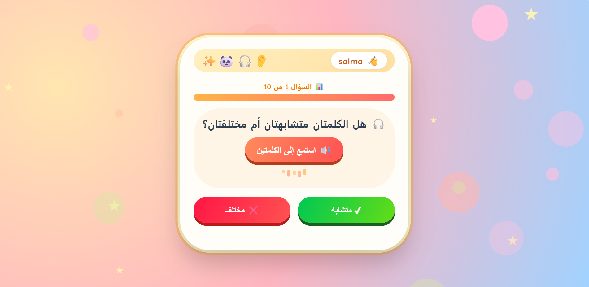

# 🧠 MindSteps - AI-Based Auditory Learning Assessment System

## 📌 Overview

MindSteps is an interactive web application designed for the early detection of learning difficulties in children, focusing on auditory discrimination skills.

The system provides listening-based activities where children identify whether two words are similar or different. Based on their responses, the system analyzes performance and generates an AI-based report to assist parents and educators.

---

## 🎯 Objectives

* Detect early signs of learning difficulties
* Assess auditory discrimination skills
* Provide an engaging and child-friendly experience
* Generate intelligent, AI-powered reports

---

## ✨ Features

* Interactive auditory question system
* Text-to-Speech (TTS) audio playback
* Real-time answer evaluation
* Progress tracking
* AI-generated performance analysis and recommendations

---

## 👥 Target Users

* Children aged 7–8
* Parents
* Educators

---

## 🔄 System Workflow

Child Input → Question Display → Audio Playback → Answer Selection → Evaluation → AI Analysis → Report Generation

---

## 🖼️ Preview



---

## 🛠️ Technology Stack

* Backend: Django (Python)
* Frontend: HTML, CSS, JavaScript
* Database: SQLite
* AI Model: Mistral (via Ollama)
* Audio: Text-to-Speech (TTS)

---

## 🤖 AI System

The system utilizes a Large Language Model (LLM) to analyze the child's responses and generate structured performance reports.

It applies prompt engineering techniques to ensure consistency, clarity, and reliability of AI-generated outputs.

---

## 📂 Project Structure

```
assessment/
│
├── models.py
├── views.py
├── templates/
├── static/
├── ai/
```

---

## ⚙️ Installation

```bash
git clone https://github.com/salmaalahmad320-blip/Mindsteps.git
cd Mindsteps
python -m venv venv
venv\Scripts\activate
pip install -r requirements.txt
python manage.py migrate
python manage.py runserver
```

---

## ⚠️ Notes

* The AI model runs locally using Ollama
* TTS performance may vary depending on system resources

---

## 🚀 Future Improvements

* PDF report generation
* Mobile application version
* Additional cognitive assessments (memory, visual skills)
* Teacher dashboard

---

## 🧾 Conclusion

MindSteps combines artificial intelligence, audio processing, and interactive design to provide an effective solution for early detection of learning difficulties, enabling timely support for children.

---

## 👩‍💻 Author

Salma Al Ahmad
AI & Data Science Student
